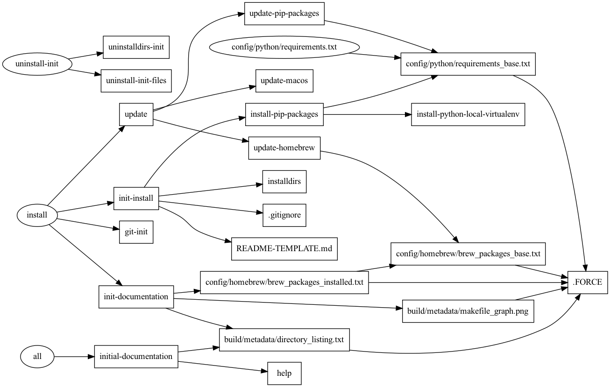
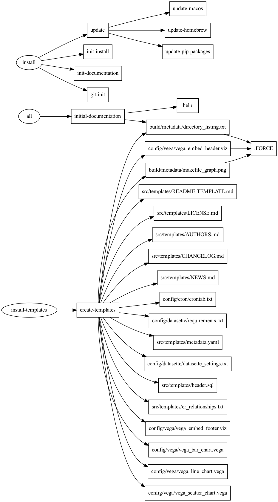

# makefile_analytics_project
## Brief Description
This project is a [makefile](https://www.gnu.org/software/make/) for macOS systems that installs a python virtual environment using [Homebrew](https://brew.sh) and [pyenv](https://github.com/pyenv/pyenv). It also demonstrates how to organize and document a makefile project. 

This project grew out of the desire to improve the manual process to set up the development environment described in the book [Building Data Products: Data and Analytics Engineering for non-programmers.(https://www.minimumviablearchitecture.com)

**NOTE:** Setting up a Python environment that works today and a year from now can be incredibly frustrating if you are new to Python. I hope this helps.
 
## Project Status
**ACTIVE**
 
## Problem Statement
Reliably setting up and updating the basic software for a project is difficult. Wouldn't it be nice to automate the process so that each new project starts from the same place?

## Who is this for?
In general, this could be used as a start for any Python basic project. Specifically, this is for data analysts who may not have the understanding and sufficient *muscle memory* to setup and update their development and build systems. 
 
## Prerequisites
[ ] MacOS computer  
[ ] Admin access to install software.  
[ ] Access to the internet.  
[ ] A basic Homebrew and Python *pyenv* environment setup following the the [makefile_system_setup repository] (https://github.com/brianmcmillan/makefile_system_setup).
 
## Usage
1. Create a directory with the name of your new project within your development environment (e.g., ~/documents/GitHub/).
1. Copy the makefiles from this repository into that directory.
1. Run `make` to see the tasks in the makefile.

```makefile
all                  Executes the default make task.
help                 List of all makefile tasks.
install              Run once when setting up a new project.
update               Updates base software (OS, Homebrew, python, pip)
```
 
### First time setup
Run: `make install`

This will:
- Update macOS.
- Update Homebrew, and install a number of UNIX utilities, if needed.
- Download and install a specific version of Python (e.g., 3.10.2) as defined in the makefile and then configures that version of python in this local directory.
- Downloads and installs a couple `pip` packages to automate the creation of a picture of the pipeline steps.
- Creates some basic documentation of the project.
- Initializes a local git repository with the name of the project. 

#### Results
The following directories and files are created after `make install` is run.
These files are regenerated each time the project is updated in order to ensure the system configuration documentation stays up to date.

```text
.
├── README-TEMPLATE.md
├── README.md
├── build
│   └── metadata
│       ├── directory_listing.txt
│       ├── makefile_graph.png
│       └── makefile_graph.txt
├── config
│   ├── homebrew
│   │   ├── brew_packages_base.txt
│   │   └── brew_packages_installed.txt
│   └── python
│       ├── requirements.txt
│       └── requirements_base.txt
├── init_database.mk
├── init_project.mk
├── log
│   └── makefile_analytics_project.log
├── macros.mk
├── makefile
├── templates.mk
└── variables.mk
```

The makefile (`init_project.mk`) is executing the following tasks:  


These files are stored in the `build/metadata/` directory. The configuration data for the Homebrew packages installed system-wide and the python pip packages are stored under the `config/` directory.

**brew_packages_base.txt:**
```text
coreutils
zlib
openssl
readline
xz
git
tree
gawk
pyenv
pyenv-virtualenv
makefile2graph
graphviz
```

**brew_packages_installed.txt:**
```text
aom 3.3.0
aspell 0.60.8
autoconf 2.71
...
xsv 0.13.0
xz 5.2.5
zlib 1.2.11
```

**requirements_base.txt:**
```text
makefile2dot==1.0.2
pygraphviz==1.9
sqlite-utils==3.22.1
ERAlchemy==1.2.10
SQLAlchemy==1.3.24
datasette==0.61.1
datasette-copyable==0.3.1
datasette-vega==0.6.2
datasette-yaml==0.1.1
```

**requirements.txt:**
```text
aiofiles==0.8.0
anyio==3.5.0
asgi-csrf==0.9
...
tabulate==0.8.9
typing_extensions==4.1.1
uvicorn==0.17.6
```

### Updating the software
Run: `make update`

This will:
- Update macOS.
- Update Homebrew. If the list of applications changes in the `HOMEBREW-PACKAGES` variable, these will be installed.
- Updates the `pip` packages defined in the `requirements_base.txt:` task.
- Updates the documentation of the project.

One important thing to note is that the instalation of the `pip` packages is managed through the `init_project` makefile and the `config/python/requirements_base.txt:` target. Do not edit the `requirements.txt` file directly. Another thing to note is that the software versions are explicitely set. This will minimize the likelihood that you will have conflicting versions of the packages at the time they were defined. Periodically, you will want to upgrade the packages and add new ones and that should also be done through the makefile target. 

**requirements_base.txt:**
```text
...
ERAlchemy==1.2.10
SQLAlchemy==1.3.24
datasette==0.61.1
datasette-copyable==0.3.1
datasette-vega==0.6.2
datasette-yaml==0.1.1
```

### Install the project templates
Now that the basic project structure and software has been established, the next step is to install a set of template files we will need. These files will change over time and as the team needs change, update the `templates.mk` file to make it easy to work with a common set of documents and code templates.

Run: `make install-templates`

#### Results
The following directories and files are created after `make install-templates` is run.
These files are only written one time and as they are needed, they should be copied from the `src/templates/` directory.

```text
.
├── README.md
├── build
│   └── metadata
│       ├── directory_listing.txt
│       ├── makefile_graph.png
│       └── makefile_graph.txt
├── config
│   ├── cron
│   │   └── crontab.txt
│   ├── datasette
│   │   ├── datasette_settings.txt
│   │   └── requirements.txt
│   ├── homebrew
│   │   ├── brew_packages_base.txt
│   │   └── brew_packages_installed.txt
│   ├── python
│   │   ├── requirements.txt
│   │   └── requirements_base.txt
│   └── vega
│       ├── vega_bar_chart.vega
│       ├── vega_embed_footer.viz
│       ├── vega_embed_header.viz
│       ├── vega_line_chart.vega
│       └── vega_scatter_chart.vega
├── init_database.mk
├── init_project.mk
├── log
│   └── makefile_analytics_project.log
├── macros.mk
├── makefile
├── readme_files
│   ├── install_directory_listing.txt
│   └── install_makefile_graph.png
├── src
│   └── templates
│       ├── AUTHORS.md
│       ├── CHANGELOG.md
│       ├── LICENSE.md
│       ├── NEWS.md
│       ├── README-TEMPLATE.md
│       ├── er_relationships.txt
│       ├── header.sql
│       └── metadata.yaml
├── templates.mk
└── variables.mk
```
The makefile (`init_project.mk`) is executing the following tasks:  



----

## Support
Open an issue in the GitHub repository.
 
## Roadmap
- Support Linux builds. Is there an advantage to using Homebrew for Linux?
 
## How you can help
- Open an issue in the GitHub repository.
- Open a PR.
- Contact me to discuss your ideas: brian [at] minimumviablearchitecture.com
 
### License
[MIT](LICENSE.md)

## Notes on specific files
### er_relationships.txt
This file is used to define the relationships between the tables in the database.  
The basic structure id `<table_name><relationship><table_name>`  
The types of relationships are defined using the following patterns:  

```
<table 1> 1--1 <table 2>
1 - Exactly one
? - 0 or 1
* - 0 or more
+ - 1 or more
```


